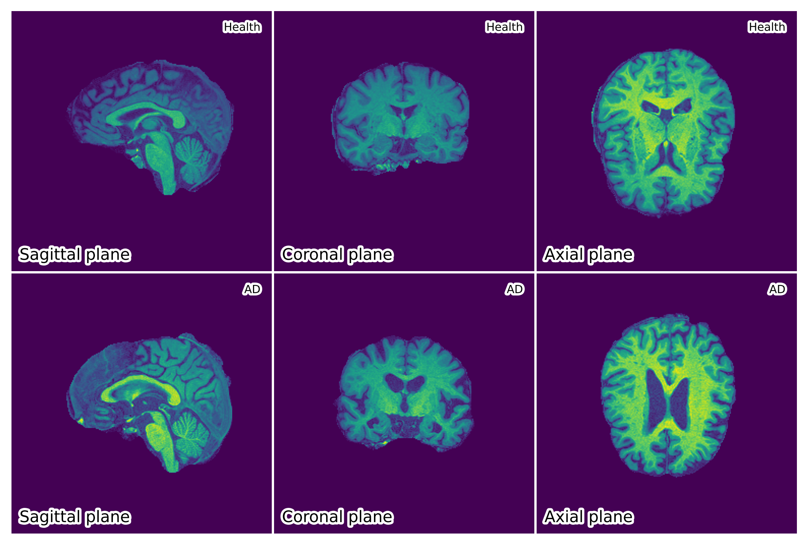
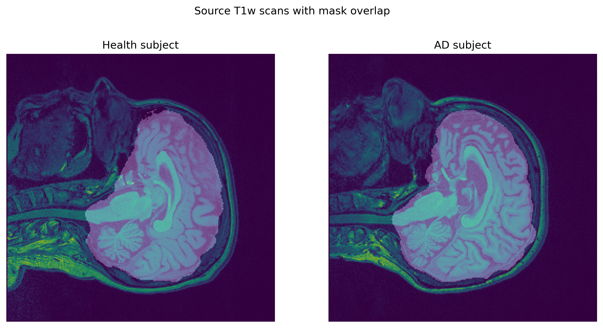
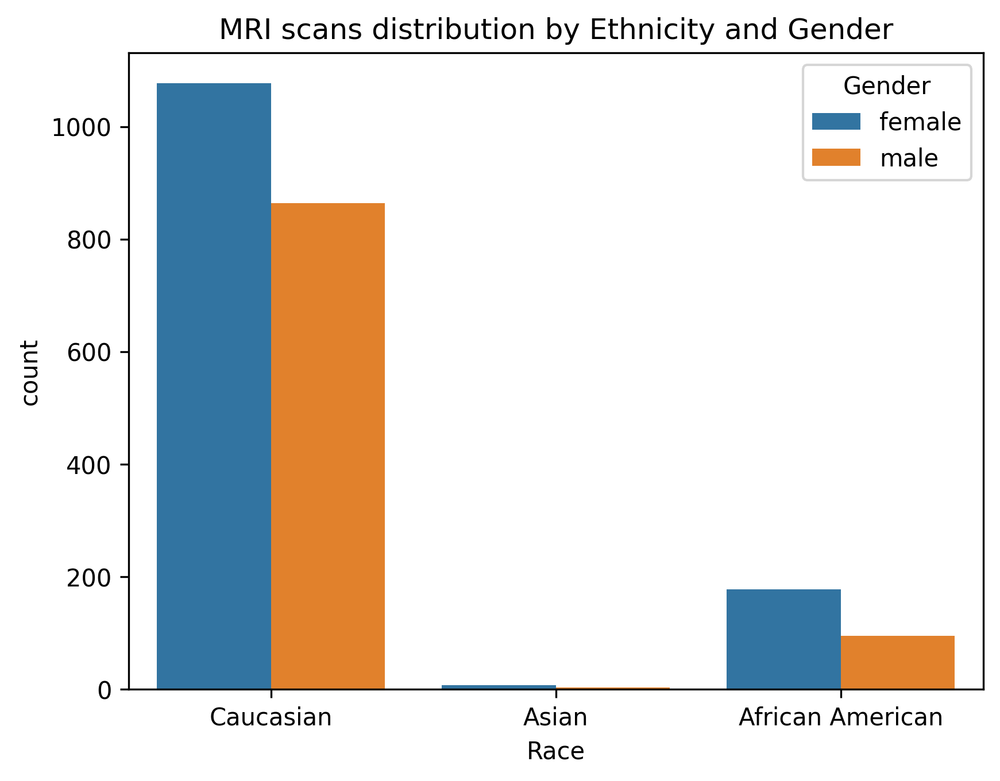
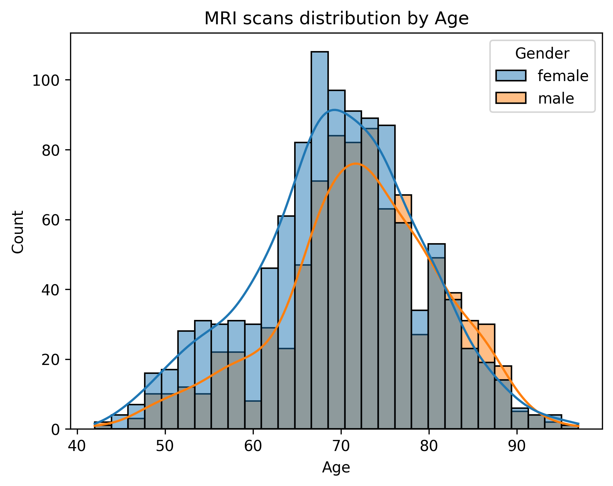
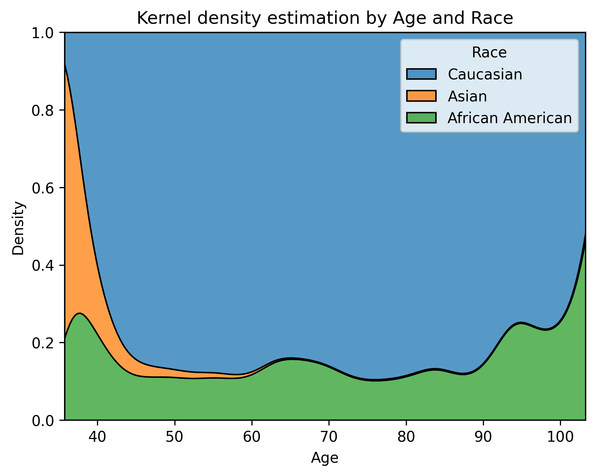

--- 
annotations_creators: machine-generated
language: eng
language_creators: other
license: cc-by-sa-4.0
multilinguality: monolingual
pretty_name: OASIS3-AD_MRI
size_categories: 1K<n<10K
source_datasets: extendedOASIS-3
tags:
- medical
- mri
- brain
- alzheimer
  task_categories: image-classification
  task_ids: []
---

# Dataset Card for MRI-OASIS3

## Table of Contents
- [Table of Contents](#table-of-contents)
- [Dataset Description](#dataset-description)
    - [Dataset Summary](#dataset-summary)
    - [Languages](#languages)
- [Dataset Structure](#dataset-structure)
    - [Data Instances](#data-instances)
    - [Data Fields](#data-fields)
    - [Data Splits](#data-splits)
- [Dataset Creation](#dataset-creation)
    - [Curation Rationale](#curation-rationale)
    - [Source Data](#source-data)
    - [Annotations](#annotations)
    - [Personal and Sensitive Information](#personal-and-sensitive-information)
- [Considerations for Using the Data](#considerations-for-using-the-data)
    - [Social Impact of Dataset](#social-impact-of-dataset)
    - [Discussion of Biases](#discussion-of-biases)
    - [Other Known Limitations](#other-known-limitations)
- [Additional Information](#additional-information)
    - [Dataset Curators](#dataset-curators)
    - [Licensing Information](#licensing-information)
    - [Citation Information](#citation-information)
    - [Contributions](#contributions)

## Dataset Description

- **Homepage:** [OASIS Brain](https://www.oasis-brains.org/)
- **Paper:** [P. J. LaMontagne et al., “OASIS-3: Longitudinal Neuroimaging, Clinical, and Cognitive Dataset for Normal Aging and Alzheimer Disease”](https://www.medrxiv.org/content/10.1101/2019.12.13.19014902v1)

### Dataset Summary
The OASIS-3 dataset contains several neuroimaging data coming from different tools (PET, CT, MR) as well as some clinical data
of the patients belonging to the study.
MRI-OASIS3, a subset of the OASIS-3, is made up only of MR (Magnetic Resonance) scans, and only structural T1w MRI are taken into account.
Each scan in the dataset has been pre-processed in order to obtain only the brain volume (no bones, fat and other
anatomical structures are in the final scan).
This is performed using the post-processed Freesurfer files (also available in OASIS-3).
For each scan the value of the voxels is normalized into a $$[0,1]$$ interval by means of a min-max scaler whose formula is shown below.

$$ output_{px} = \frac{input_{px}-input_{min}}{input_{max}-input_{min}} $$

In cases in which multiple scans are taken for the same subject in a single session, only the first scan is considered.

### Languages
The diagnosis available in the clinical data are written using medical language (English). 

## Dataset Structure

```
data    
│
└───raw
│   │   clinical-data.csv
│   │   mri-scans.csv
│   │   subjects.csv
│   │   clinical-map.json
│   │
└───external
│   ├───OASIS3_MRI_SESSIONS            <- main folder for download MR session from XNAT
│   │   │───OAS30001_MR_d0129
│   │   │   │ anat1            <- this folder will contains a single MR scan
│   │   │   │ anat2
│   │   │   │ ...
│   │   │   ...
│   │   │
│   ├───OASIS3_MRI_FREESURFER   <- main folder for download Freesurfer files from XNAT
│   │   │───OAS30001_MR_d0129
│   │   │   │ label
│   │   │   │ mri
│   │   │   │ ...
│   │   │   ...
│   
└───processed
    │   clinical-mr.csv
    │   clinical-mr-full.csv
    │───data
    │   │ OAS30001_MR_d0129.npz
    │   │ OAS30001_MR_d0757.npz
    │   │ ...
    │   ... 
```

*These scripts are a modified version of the ones provided by OASIS3 and described in section [Initial data collection and normalization](#initial-data-collection-and-normalization) modified so that the password can be passed as argument while in the original script must be provided interactively.
### Data Instances
Below a fragment of the file ```clinical-mri.csv``` such file whose details are provided in the section [Source Data](#phase-1-preliminary-steps).
Maps the clinical assessments with the corresponding (closest) MR session.

| ADRC_ADRCCLINICALDATA_ID    | Subject  | MR_ID             | ageAtEntry | Age  | DaysAfterEntry_clinic | DaysAfterEntry_mr | DaysDistance | Scanner | T1w | T2w | Freesurfer_ID               | mmse | cdr | dx1                    | dx2 | dx3 | dx4 | dx5 | commun | homehobb | judgment | memory | orient | perscare | apoe | sumbox | height | weight |
|-----------------------------|----------|-------------------|------------|------|-----------------------|-------------------|--------------|---------|-----|-----|-----------------------------|------|-----|------------------------|-----|-----|-----|-----|--------|----------|----------|--------|--------|----------|------|--------|--------|--------|
| OAS30001_ClinicalData_d0000 | OAS30001 | OAS30001_MR_d0129 | 65.149895  | 65.0 | 0                     | 129.0             | 129.0        | 3.0T    | 2.0 | 2.0 | OAS30001_Freesurfer53_d0129 | 28.0 | 0.0 | Cognitively normal     | .   | .   | .   | .   | 0.0    | 0.0      | 0.0      | 0.0    | 0.0    | 0.0      | 23.0 | 0.0    |        |        |
| OAS30001_ClinicalData_d0339 | OAS30001 |                   | 65.149895  |      | 339                   |                   |              |         |     |     |                             | 28.0 | 0.0 | Cognitively normal     | .   | .   | .   | .   | 0.0    | 0.0      | 0.0      | 0.0    | 0.0    | 0.0      | 23.0 | 0.0    | 64.0   | 155.0  |
| OAS30001_ClinicalData_d0722 | OAS30001 | OAS30001_MR_d0757 | 65.149895  | 67.0 | 722                   | 757.0             | 35.0         | 3.0T    | 2.0 | 2.0 | OAS30001_Freesurfer53_d0757 | 30.0 | 0.0 | Cognitively normal     | .   | .   | .   | .   | 0.0    | 0.0      | 0.0      | 0.0    | 0.0    | 0.0      | 23.0 | 0.0    | 64.0   | 162.0  |
| ...                         | ...      | ...               | ...        | ...  | ...                   | ...               | ...          | ...     | ... | ... | ...                         | ...  | ... | ...                    | ... | ... | ... | ... | ...    | ...      | ...      | ...    | ...    | ...      | ...  | ...    | ...    | ...    |
| OAS30024_ClinicalData_d0000 | OAS30024 | OAS30024_MR_d0084 | 76.643394  | 76.0 | 0                     | 84.0              | 84.0         | 3.0T    | 1.0 | 0.0 | OAS30024_Freesurfer53_d0084 | 27.0 | 0.5 | AD Dementia            | .   | .   | .   | .   | 0.5    | 0.5      | 0.5      | 0.5    | 0.5    | 0.0      | 34.0 | 2.5    | 55.0   | 89.0   |
| OAS30024_ClinicalData_d0345 | OAS30024 |                   | 76.643394  |      | 345                   |                   |              |         |     |     |                             | 26.0 | 0.5 | AD dem w/CVD contribut | .   | .   | .   | .   | 0.5    | 0.5      | 0.5      | 1.0    | 0.0    | 0.0      | 34.0 | 2.5    | 55.0   | 92.0   |
| ...                         | ...      | ...               | ...        | ...  | ...                   | ...               | ...          | ...     | ... | ... | ...                         | ...  | ... | ...                    | ... | ... | ... | ... | ...    | ...      | ...      | ...    | ...    | ...      | ...  | ...    | ...    | ...    |

NOTE: not all entries have a MR session

On the other side there are the actual MR T1w MR scans already processed as described in the
section [Source Data](#phase-2-processing-steps), here we show a slices for the three planes from a MRI of an healthy subjects and one from an AD patient.


### Data Fields
Below we will describe the fields of the csv files , clinical-data and mri-scans are dumped from the dataset in the OASIS-3 2022 version

#### Clinical data
file located under data/raw/clinical-data.csv

| Column name              | Type   | Description                                                                |
|--------------------------|--------|----------------------------------------------------------------------------|
| ADRC_ADRCCLINICALDATA_ID | string | ADRC identifier eg: OAS30001_ClinicalData_d0000                            |
| Subject                  | string | Subject identifier eg: OAS30001                                            |
| mmse                     | int    | Mini-mental State Exam values ranging from 0 to 30                         |
| ageAtEntry               | float  | Age of the subject at the first examination                                |
| cdr                      | float  | Clinical Dementia Rating                                                   |
| dx1                      | string | Clinical assessment in medical language                                    |
| dx2                      | string | Clinical assessment in medical language                                    |
| dx3                      | string | Clinical assessment in medical language                                    |
| dx4                      | string | Clinical assessment in medical language                                    |
| dx5                      | string | Clinical assessment in medical language                                    |
| commun*                  | float  | Community affairs                                                          |
| homehobb*                | float  | Home and hobbies score                                                     |
| judgment*                | float  | Judgement and decision making score                                        |
| memory*                  | float  | Memory score                                                               |
| orient*                  | float  | Orientation score                                                          |
| perscare*                | float  | Personal care score                                                        |
| sumbox                   | float  | Sum of above from commun from perscare                                     |
| apoe                     | float  | Apolipoprotein E described in the form fo couple of number combining 2,3,4 |
| height                   | float  | Height in inches (in)                                                      |
| weight                   | float  | Weight of the subject in pounds (lb)                                       |

*these scores are the ones used for the calculation of the CDR score.
#### MRI Scans
file located under data/interim/mri_scans.csv

| Column name    | Type   | Description                                       |
|----------------|--------|---------------------------------------------------|
| MR_ID          | string | MRI identifier (eg. OAS30001_MR_d0129)            |
| Subject        | string | Subject identifier                                |
| Age            | int    | Age of the subject at the scan time               |
| Scanner        | string | One of 3.0T or 1.5T magnetic field strength       |
| T1w            | int    | Number of available T1w scans                     |
| T2w            | int    | Number of available T2w scans                     |
| DaysAfterEntry | int    | Days after first entry on which the scan is taken |
| Freesurfer_ID  | string | Identifier of the post-processed Freesurfer files |

#### Subjects

file located under data/raw/subjects.csv

| Column name | Type   | Description                                       |
|-------------|--------|---------------------------------------------------|
| Subject     | string | Subject identifier                                |
| Gender      | string | Gender of the subject                             |
| Hand        | string | dominant hand of the subject                      |
| Education   | int    | years of education                                |
| MR Count    | int    | number of available MRIs                          |
| Race        | string | Subject race (Asian, African American, Caucasian) |
| Ethnicity   | string | Subject ethnicity (Non-Hispanic or None)          |
| M/F         | string | Gender of the subject as single character         |

#### ClinicalMRI

file is located under data/processed/clinical-mri.csv (or data/processed/clinical-mri-full.csv)
The difference between clinical-mri.csv and clinical-mri-full.csv is that the latter includes
clinical entries without an associated MRI session

| Column name              | Type   | Description                                                          |
|--------------------------|--------|----------------------------------------------------------------------|
| ADRC_ADRCCLINICALDATA_ID | string | Clinical data identifier                                             |
| Subject                  | string | Subject identifier                                                   |
| MR_ID                    | string | MR session identifier                                                |
| ageAtEntry               | float  | Age of the subject at entry in the study                             |
| Age                      | float  | Age of the subject during the MR session (can be null)               |
| DaysAfterEntry_clinic    | int    | Days after entry of the clinical visit                               |
| DaysAfterEntry_mr        | int    | Days after entry of the MR session                                   |
| DaysDistance             | int    | Absolute difference from DaysAfterEntry_clinic and DaysAfterEntry_mr |
| Scanner                  | string | Type of scanner one of 1.5T and 3.0T                                 |           
| T1w                      | int    | Number of availabel T1w scan                                         |
| T2w                      | int    | Number of available T2w scan                                         |
| Freesurfer_ID            | string | Freesurfer identifier                                                |
| mmse                     | float  | Mini-Mental scale examination score                                  |
| cdr                      | float  | Clinical dementia rating                                             |
| dx1                      | string | Clinical diagnosis in medical language                               |
| dx2                      | string | Clinical diagnosis in medical language                               |
| dx3                      | string | Clinical diagnosis in medical language                               |
| dx4                      | string | Clinical diagnosis in medical language                               |
| dx5                      | string | Clinical diagnosis in medical language                               |
| commun*                  | float  | Community affairs score                                              |
| homehobb*                | float  | Home and hobbies score                                               |
| judgment*                | float  | Judgment and problem-solving                                         |
| memory*                  | float  | Memory score                                                         |
| orient*                  | float  | Orientation score                                                    |
| perscare*                | float  | Personal care score                                                  |
| sumbox                   | float  | Sum of the previous scores from commun to perscare                   |
| apoe                     | float  | Apolipoprotein E                                                     |
| height                   | float  | Height of the subject in inches (in)                                 |
| weight                   | float  | Weight of the subject in pound (lb)                                  |


*these scores are the ones used for the calculation of the CDR score.

### Data splits
The OASIS-3 dataset doesn't come with a predefined train/test split: for this reason a k-fold cross validation
is preferred to perform the evaluation.
To prevent data leakage the _Grouped_ split method is adopted, which is provided by scikit-learn,
for example ```sklearn.model_selection.StratifiedGroupKFold``` method where each subject represent a single group. 

## Dataset Creation

### Curation Rationale
This dataset has been created in order to standardize size, orientation and normalization steps for each T1w MRI; as well as to define a reliable test set.

### Source Data
Source data are provided by the OASIS-3 initiative, more details about are reported on their [website](https://www.oasis-brains.org/)

Data included in OASIS was collected on the following scanners:
- Siemens BioGraph mMR PET-MR 3T scanner (51010)
- Siemens TIM Trio 3T MR scanner (2 scanners) (35177 & 35248)
- Siemens Magnetom Vida 3T MR scanner (175614)
- Siemens Prisma_fit 3T MRI scanner (167047)
- Siemens Sonata 1.5T scanner (21926)
- Siemens Vision 1.5T scanner
- Siemens Avanto 1.5T scanner (26321)

The scanning methods are summarized in the following:
- Participants were placed in the scanner head to foot while lying in the supine position.
- Head immobilization was done by placing small foam cushions between the head and the head coil.
- In many participants, a Vitamin E capsule was used to mark the left temple.
- For all scans a 16-channel head coil was used.
- Participants receiving simultaneous PET acquisition, on the BioGraph mMR were injected with tracer prior
  to initiation of MRI scanning
- Magnetom Vida scan sessions were converted to NIFTI format from enhanced DICOM format

#### Initial Data Collection and Normalization
Data are downloaded from the [XNAT](https://www.xnat.org/) repository of the OASIS-3 (more info available in this [repository](https://github.com/NrgXnat/oasis-scripts)),
the data processing pipeline can be roughly divided into two phases.

##### Phase 1: Preliminary steps
From the same source we get: the collection of clinical data; the summary of subjects; the list of mri scans and corresponding Freesurfer identifiers.
These textual data, downloaded in the form of CSV file, have been cleaned by removing empty fields (due to the anonymization process).
We merged in the same file the list of MRI and the corresponding Freesurfer identifiers, this file with MRI and Freesurfer identifier is used to download the actual data.
After this we have removed from the MRI list the entries without an available Freesurfer and
associated each scan with the corresponding clinical visit by a time proximity criterion (by considering ```DaysAfterEntry``` field)
At the end of this process we obtain a collection of visits associated with a single mri scan, all saved in the file [clinical-mri.csv](#ClinicalMRI).

##### Phase 2: Processing steps
We downloaded the MRI and Freesurfer files listed in the file generated at the previous step.
For each MRI session we select the T1w (if there are more "run" in the same session we select the first),
the MR scan (and the corresponding brain mask) is then rotated according to LPS (right to Left, anterior to Posterior, inferior to Superior) coordinate system,
and the resolution is standardized, along all axes, to 1.0mm/px.
We apply a min-max scaler to the values of the scan so that the final values range from 0 to 1.
The brain mask, available in the freesurfer files, is binarized with a zero threshold, and a morphological closing is performed on the mask (to remove possible gaps within the volume). Finally, by point wise multiplication, we extract the masked volume that represent our ROI.
The last step consists in the crop of the empty space around the ROI and consequent centering on the brain.
The final size of the MR scan is 160x200x168: such measure is roughly equals to the maximum size of the brains in the dataset along each dimension.

The figure shows the original MR scan (rotated in order to match with the brain mask) with the overlapping mask, the darker area is the ROI that we extract.

### Annotations

#### Annotation process

This dataset does not provide any predefined annotation on the MR scans, however the CSV files into the ```raw``` 
folder can be used for instance to infer custom labels depending on the task.

### Personal and Sensitive Information

The OASIS-3 dataset is fully anonymized, so there are no sensitive information neither in textual files nor in MRIs.

## Considerations for Using the Data

### Social Impact of Dataset

This dataset can be used into studies focused on neurodiseases through MR imaging tools,
with the increase in life expectancy more people will be affected by neurodegenerative disease.

### Discussion of Biases
While the OASIS-3 dataset is almost equal distributed with respect to subjects' gender there is a low representation of
African American people and an even lower representation of Asian people. Below graphical summaries of T1w scans
distributions according to different criteria.

|  |  |
|----------------------------------------------------|---------------------------------------------------|
|        |                                                   |


### Other Known Limitations

The dataset is focused on neurodegenerative diseases and does not contain information about younger people, as there are no subjects with less than 40 years.

## Additional Information

Contact

### Licensing Information

The OASIS-3 dataset is accessible by data request that must be done using the [project website](https://www.oasis-brains.org/)

### Citation Information

OASIS-3 dataset paper:

> P. J. LaMontagne et al., “OASIS-3: Longitudinal Neuroimaging, Clinical, and Cognitive Dataset for Normal Aging and Alzheimer Disease,” Radiology and Imaging, preprint, Dec. 2019. doi: [10.1101/2019.12.13.19014902](https://doi.org/10.1101/2019.12.13.19014902).


### Contributions

Thanks to [@valeriolong](https://github.com/valeriolong) for adding this dataset.
