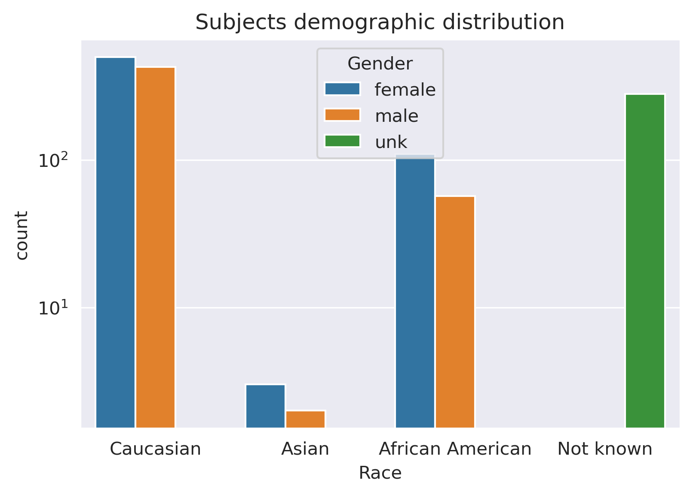
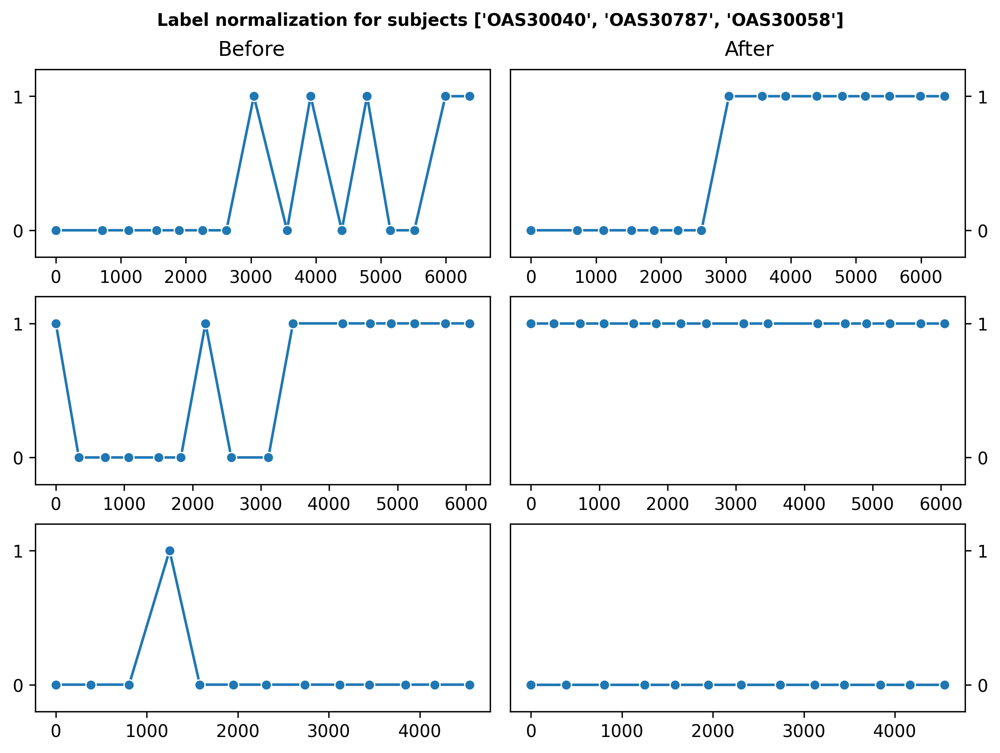

# Model Card for 3dConvAD

## Table of contents
* [Model Details](#model-details)
* [Itended Use](#itended-use)
* [Factors](#factors)
* [Metrics](#metrics)
  * [Model performance measure](#model-performance-measure)
* [Data](#data)
  * [Labeling data](#labeling-data)
  * [Evaluation Data](#evaluation-data)
  * [Training data](#training-data)
* [Quantitative analysis](#quantitative-analysis)
* [Ethical consideration](#ethical-consideration)
* [Caveats and recommendation](#caveats-and-recommendation)
* [Bibliography](#bibliography)

# Model Details
3dConvAD is a classification model based on 3D convolutional neural network for Alzheimer's Dementia detection through structural MRI scans;
is trained on part of the OASIS3 dataset, with no human labeled scans, using a rule based approach to derive a ground truth.
The clinical assessments provided in the OASIS3 dataset are used to label the MRI scans,
and such scans are then used to detect Alzheimer's Dementia (AD) in the patients.
The model provides also some forms of interpretability in the form of Integrated Gradients[^1] 
that should make explicit the learned relevant region in the brain scan.


# Itended Use
The model is intended to provide a probabilistic prediction of Alzheimer's dementia using only the subject's MRI scan of the brain.
3dConvAD is **not intended** as a standalone diagnostic tool but as an aid for specialized doctors.

# Factors
The model is trained with a subset of the OASIS3 dataset.
The following is extracted from the description of the project:
>OASIS-3 is a retrospective compilation of data for 1378 participants that were collected across several 
>ongoing projects through the WUSTL Knight ADRC over the course of 30 years.
>Participants include 755 cognitively normal adults and 622 individuals at various stages of 
>cognitive decline ranging in age from 42 to 95 years.
 
The dataset population is almost equally distributed across genders (55.6% F 44.4% M),
while there are consistent differences over the Ethnicity in which caucasian people are over-represented;
the figure depicts the overall distribution



The clinical assessments provided by the dataset are performed by medical personnel.

# Metrics
## Model performance measure
The measures of choice are:
- Accuracy
- Precision
- Sensitivity (Recall)
- Specificity
- AUROC: summary of the ROC curve

Being in a medical domain, the sensitivity measure is rated more than the other measures.
We can expect results in line with similar models applied on the same task.
We will use following threshold measures for acceptance:

- AUROC > 0.8
- Sensitivity > 0.6
- Specificity > 0.8

The evaluation is performed by the means of a _stratified 5-fold cross validation_.
To prevent data leakage from the train to the test set we must ensure that different scans
of the same subject don't belong, at the same time, to both train and test set.

The fairness evaluation is achieved through genders' confusion matrices,
to check that the "Equality of Opportunity" and the "Equality of Odds" principles are fulfilled.

# Data
## Labeling data
As the scans in the dataset are not labeled the problem is tackled as a binary classification task, thus considering two values for the labels:
- 1 for AD being diagnosed
- 0 for AD not being diagnosed

To assess the ground truth we rely on the different clinical diagnosis: the dataset provides up to 5 different
diagnosis written in medical language. 
Each diagnosis is mapped to 0 or 1, according to our labelling convention, and the overall diagnosis is positive (value 1)
if at least one of the available diagnosis is positive.
To improve such strategy, that can lead to some false positive, each subject's overall diagnosis is normalized 
using a majority vote criterion: the rationale behind this choice is that AD is an uncurable neurodegenerative disease 
that is slowed down by treatments.
Below we report the code used to normalize a single subject overall diagnosis

```
import numpy as np
from collections import Counter

def normalize(diagnosis_series):
    normalized = np.copy(diagnosis_series)
    for i in range(len(diagnosis)-1): # we stop when there there is only one diagnosis left 
        if diagnosis[i]:
            window = diagnosis[i:len(diagnosis)]
            majority = Counter(window)
            vote = True if majority[True] > majority[False] else False
            normalized[i:len(diagnosis)] = np.full((len(diagnosis)-i),vote)

    return list(normalized)
```
The effect of this normalization procedure is depicted in the chart below


## Evaluation Data
The evaluation dataset is obtained using k-fold cross-validation as stated before. The samples 
in the test set belong to the same population as the training set, but we ensure that depict different subjects.

## Training data
On the training set data augmentation is performed through random 3d rotations and mirroring on MRIs.

# Quantitative analysis
Work in progress...

# Ethical consideration
Since the OASIS-3 dataset is anonymized we have no information about subjects' nationality and thus their
accessibility, or lack of it, to the medical care system.
Therefore dataset may not be representative of the actual worldwide distribution of the AD disease.
By using this model there is a moderate risk of misassessment that can lead to wrong or late diagnosis in AD patients.

# Caveats and recommendation

The model is trained and evaluated over three macro experiments that slightly change the dataset composition:
1. Without perform upsampling and downsampling, to preserve the natural unbalance of the distribution of the AD patients
2. Using regularization factors on the loss function during the training phase
3. Performing downsampling and upsampling, to balance the distribution of the the AD patients in the train dataset

# Bibliography
[^1] M. Sundararajan, A. Taly, and Q. Yan, “Axiomatic Attribution for Deep Networks.” arXiv, Jun. 12, 2017. Accessed: Oct. 06, 2022. [Online]. Available: http://arxiv.org/abs/1703.01365


---
- language: en
- license: afl-3  
- tags:
  - image
  - MRI
  - Alzheimer's dementia
  - medical
  - brain disease
- datasets:
  - MRI-OASIS3
- metrics:
  - accuracy
  - roc_auc
  - precision
  - recall
  - specificity

---

This markdown file contains the spec for the modelcard metadata regarding evaluation parameters. When present, and only then, 'model-index', 'datasets' and 'license' contents will be verified when git pushing changes to your README.md file.
Valid license identifiers can be found in [our docs](https://huggingface.co/docs/hub/repositories-licenses)